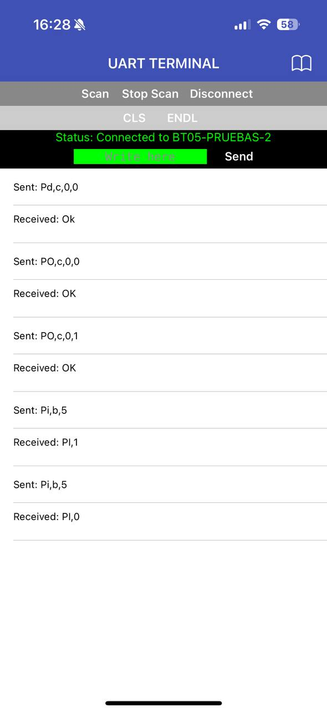

# BLE-HM10
This is a repository for the ones interested in developing BLE COM with modules such as HM10 with their arduino or microprocessors (It works with a PIC32MX from MPLAB) . I found several sources but none of then was working on the first shot or it simply something was updated and it is no longer valid.

- [IO DEVICE - ARDUINO](#io-device---arduino)
    + [Files](#files)
    + [Requirements](#requirements)
    + [Code Description](#code-description)
    + [How to Use](#how-to-use)
    + [References](#references)
- [Terminals](#terminals)
  * [APP from store](#app-from-store)
  * [MIT APP INVENTOR](#mit-app-inventor)
    + [How to load the app](#how-to-load-the-app)
    + [How to use the app](#how-to-use-the-app)
    + [References](#references-1)
  * [PYTHON UART Service Example](#python-uart-service-example)
    + [Features](#features)
    + [Prerequisites](#prerequisites)
    + [Setup Instructions](#setup-instructions)
    + [Usage](#usage)
    + [Key Constants](#key-constants)
    + [References](#references-2)

# IO DEVICE - ARDUINO
This project sets up an Arduino to communicate with a Bluetooth Low Energy (BLE) HM-10 module using UART (serial communication). It uses the `SoftwareSerial` library to create a virtual serial port, allowing AT commands to be sent to the module to change its configuration, such as its device name.

### Files

- `UARTBLEHM10.ino`: Arduino sketch source code.

### Requirements

- Arduino UNO (or compatible board)
- HM-10 BLE module
- Wiring:
  - HM-10 TX → Arduino Pin 10
  - HM-10 RX → Arduino Pin 11 
- Library: `SoftwareSerial` (included with the Arduino IDE)

### Code Description

- Initializes two serial ports:
  - `Serial`: USB communication with the serial monitor.
  - `SoftwareSerial`: Communication with the HM-10 module.
- Sends AT commands to the BLE module:
  - Changes the module's name using the `AT+NAME` command.
- Act as a terminal with the serial monitor of the ARDUINO IDE

### How to Use

1. Connect the BLE module to the Arduino as described above.
2. Upload the sketch to the Arduino.
3. Open the Arduino IDE Serial Monitor at 9600 baud.
4. Watch for responses from the BLE module.
5. You can customize the name by editing this line and changing the boolean variable on top of the file:
   ```cpp
   String NAME = "AT+NAMEBT05-" + String(0) + String(1) + "\r\n";
### References
Original code adapted from https://blog.espol.edu.ec/girni/hm-10-serial-con-arduino-a-pc/

# Terminals
Existing terminals are an easy way to check if the module is working. However, since I don't want to depend on external app providers, I found MIT APP INVENTOR or a PYTHON terminal more interesting for my students since they can customize and create their own interfaces. Please check the following alternatives.


## APP from store:
I wrote here the ones that work for me:
- On Android:
  - Pending to write.
- On IOS (More complicate to find):
  -  [BLE Serial Tiny](https://apps.apple.com/nl/app/ble-serial-tiny/id1607862132):I found it in this [Hangar42](https://www.hangar42.nl/hm10) post with a link to a github where you can find the link to the app https://github.com/hoiberg/HM10-BluetoothSerial-iOS 
  - [LightBlue](https://apps.apple.com/nl/app/lightblue/id557428110) or [nRF Connect](https://apps.apple.com/nl/app/nrf-connect-for-mobile/id1054362403) to learn about the UUID service and its characteristics.

## MIT APP INVENTOR
After several trials, especially for IOS, I obtained a working code to test the UART communications using IOS and ANDROID systems.

The app looks like this (the screenshot is from an Iphone 15 Pro) and can be adapted depending on your application:


### How to load the app
1. Import the aia project to your MIT APP INVENTOR. Please, check that the 2 TextSize blocks for the list viewers are enabled (I don't know why they are disabled when the project is loaded.) 
2. Write IOS or ANDROID in the OS global variable   . This has been the most significant pain since IOS and ANDROID act differently in the connection and the send block structure. 
3. Click Connect/Ai Companion
4. Open your Mit APP inventor app in your device

### How to use the app
1. Connect the BLE module to the Arduino or IoT device. It should be blinking.
2. Scan for new devices and click the one you want to connect. It should appear like: "Selected <NAME>"
3. Click Connect. Once connected, it should appear "Connected to <NAME>"
4. You can write messages and click send or you can receive message
5. To clear the list, click CLS
6. To add/remove '\n' from the end of your string, click ENDL/NO ENDL.
7. Pressing a message in the console will be copied to the string to send box.


### References
https://iot.appinventor.mit.edu/iot/reference/bluetoothle

## PYTHON: UART Service Example
This project demonstrates how to use the Nordic Semiconductor (nRF) UART service with Python. It allows communication with a BLE (Bluetooth Low Energy) device using the UART service.

### Features
- Scans for BLE devices and connects to a specified device.
- Sends messages to the BLE device and receives responses.
- Handles disconnection events gracefully.

### Prerequisites
- Python 3.7 or higher
- A BLE device supporting the UART service (e.g., HM-10 module)

### Setup Instructions
1. **Create a virtual environment**:
   ```sh
   python -m venv venv

2. **Activate the virtual environment**:
- On Windows:
   ```sh
   .\venv\Scripts\activate
- On macOS/Linux:
  ```sh
   source venv/bin/activate
3. **Install dependencies**:
   ```sh
   pip install bleak

4. **Run the script**:
   ```sh
   python uart_service.py

### Usage
1. When prompted, enter the BLE address of the device you want to connect to. If you know the address beforehand, you can set it in the BLE_ADDRESS variable in the script.
2. Type messages into the terminal and press ENTER to send them to the BLE device. The BLE device's responses will be displayed in the terminal.
3. To exit, press CTRL+C to force quit.

### Key Constants
- UART_SERVICE_UUID: UUID of the UART service.
- UART_RX_CHAR_UUID: UUID of the RX characteristic.
- UART_TX_CHAR_UUID: UUID of the TX characteristic.
- BLE_ADDRESS: BLE address of the target device (leave empty for user input).

### References
Original code adapted from hbldh/bleak. Documentation for the bleak library: https://bleak.readthedocs.io/
